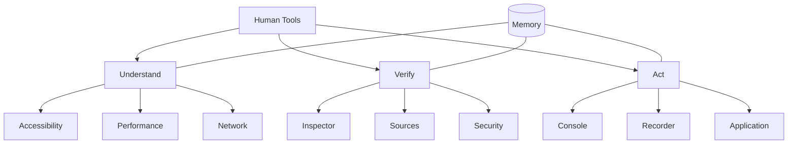
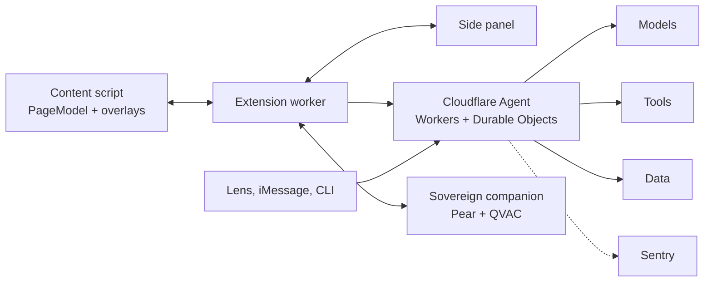

# Human Tools — Product & Technical Spec

&#32;&#32;&#32;&#32;&#32;&#32;&#32;&#32;&#32;&#32;&#32;&#32;&#32;&#32;&#32;&#32;&#32;&#32;&#32;&#32;&#32;&#32;&#32;&#32;&#32;&#32;&#32;&#32;&#32;&#32;&#32;&#32;&#32;&#32;&#32;&#32;&#32;&#32;&#32;&#32;&#32;&#32;&#32;&#32;&#32;&#32;&#32;&#32;2026-09-18 · @Someone

## Vision and positioning

Human Tools is a browser extension that gives every reader what DevTools gives a developer: a set of panels for inspecting, verifying, and acting on a page, but aimed at what the page *means* instead of how it is built.

> Browsers give developers tools to understand how websites work. Human Tools gives everyone tools to understand what websites mean.

**Category claim.** Human Tools is not "an AI extension with ten features." It is a panel-based tooling layer for the human reading the web. Each panel maps one-to-one to a DevTools panel, so the metaphor teaches the product and users already know where to look.

**Design principles**

1. **A real DevTools analogue per panel.** Same mental model, human question (Network becomes "where is the money going?").
2. **Evidence, not verdicts.** Every output is anchored to the exact text or DOM node it came from and links to a source the user can open.
3. **Explain risk, never guarantee safety or truth.** Confidence labels and "what we could not verify" are first-class UI.
4. **Inspect in place.** Overlays sit on the page element; the side panel holds detail. The page is never replaced without an undo.
5. **Heuristics first, LLM second.** Cheap DOM and rule-based signals render instantly; model output streams in behind them.
6. **Compounding value.** Memory feeds every other panel, so the tool gets more useful the longer it is used.
7. **Every integration is load-bearing.** A partner technology earns its place only if removing it would change what the user sees.

## Users and problem

Most people read the web with no tools at all: they cannot see where a claim came from, how a number was framed, or what a site is quietly doing to them, and they cannot easily act on what they read.

**Primary users**

| Persona | Situation | What they need |
| --- | --- | --- |
| Curious reader | Reading news, finance, or research articles | Trust signals, context, plain-language explanation |
| Retail investor / consumer | Earnings pages, pricing, loan and subscription pages | See where the money goes; spot fine print |
| Student / learner | Reading dense material across many sessions | Retain and connect what they learn |
| Accessibility-first user | Dyslexia, ESL, cognitive load sensitivity | Reading-level control, less clutter |
| Non-technical task doer | Government forms, cancellations, tax portals | A guided path, or "do this for me" |

**Jobs to be done**

- "Tell me if this claim is actually true and where it comes from."
- "Make this readable for me right now."
- "Show me the structure of these numbers."
- "Remind me what I already know about this topic."
- "Show me how to do this, then do it with me."

**Why now.** Fast, cheap LLMs with structured output, a browser-native side-panel API, and a large context window make page-level reasoning feasible in a few seconds. Two years ago this required a backend and a research team.

## Product model and scope

Human Tools has ten core panels grouped into three verbs (Understand, Verify, Act) with Memory underneath all of them; the hackathon build ships five, plus a lightweight Console, a Trace tab inside Inspector (the Sources panel in miniature), and Safe Preview (the Security panel in miniature).



The original concept lists Elements twice (once as Inspector, once as a page-outline panel). This spec merges them: **Inspector** owns claim-level inspection, and the page-outline view becomes an **Outline** mode inside Inspector. Navigator and Styles are treated as Console commands until they earn their own panel.

**Scope by phase**

| Panel | DevTools analogue | Human question | Phase |
| --- | --- | --- | --- |
| Inspector (with Trace tab) | Elements and Sources | What am I looking at, and where did it come from? | MVP |
| Network | Network | Where is the money going? | MVP |
| Memory | Application storage | What do I already know? | MVP |
| Performance | Performance / Lighthouse | Why is this overwhelming? | MVP |
| Recorder | Recorder | Show me how. | MVP |
| Console | Console | Ask the webpage. | MVP-lite (powers demos) |
| Security (Safe Preview) | Security | Is this safe? | Tier B |
| Accessibility | Accessibility | Make this understandable. | Post-MVP (reading-level slider is MVP-lite inside Performance) |
| Application | Application | What is this site doing with me? | Post-MVP (dark-pattern check ships with the Shopify commerce lens) |
| Sources (standalone panel) | Sources | Where did this come from? | Post-MVP (ships as the Trace tab) |
| Navigator, Styles | (none) | Where should I go? / Make it look like I need. | Console commands |

**Non-goals for the hackathon:** user accounts and login (installs use an anonymous ID), Firefox and Safari extensions, general-purpose Recorder replay beyond the prepared demo sites, production multi-tenant billing, and any claim that the tool can guarantee a page is true or safe.

## Prize strategy and integrations

The build targets the main Finalist award plus every sponsor prize that can be made real, by making each sponsor's technology load-bearing in one specific feature rather than adding logos. Two constraints shape it: the build window is about 36 hours (taken from Backboard's prize text; confirm), and Aramco's Best Beginner prize rewards collective excellence among beginner teams, so a stable, polished core matters more than the number of integrations. That is why integrations are tiered and gated in the build plan.

**Tiers.** A = core, must ship and appear in the main demo. B = a contained integration with one visible feature, cut if a gate is missed. C = stretch, started only after every Tier B item works.

| Prize | What we build for it | Where it lives | Tier |
| --- | --- | --- | --- |
| Finalist (main award) | The product itself: DevTools for humans, plus the odd, delightful pieces (Solana receipts, phone lens, ambient lamp) | Whole product | A |
| OpenAI API and Codex | OpenAI models do the reasoning: claim extraction, financial-graph extraction, verification, Console commands. Codex is the development partner, with a BUILD\_LOG of concrete assists (tests, debugging, prompt iteration) | Cloudflare Agent; repo process | A |
| GPTZero | Slop Check: AI-text detection on selected passages and hallucination detection on cited claims, shown on Inspector cards; plus a one-off Slop Report scanning a frozen set of high-profile pages | Inspector, Trace tab | A |
| Cloudflare (Agent with a Brain) | The whole backend is a Cloudflare Agent: Workers orchestrate, Durable Objects hold per-session task state, R2 stores snapshots and guides, Queues run background re-checks, KV caches | Backend | A |
| Backboard | Memory's long-term store: concepts, embeddings, RAG recall, and Console thread state, so Memory follows the user across browser, phone, and messages | Memory, Console | A |
| Aramco (Best Beginner) | Eligibility only; no product change. Called out in the README and submission | Submission | Eligibility |
| Sentry | Tracing on every pipeline stage, Logs, AI agent monitoring on the Review Team, Uptime Monitoring on the backend; used to enforce the latency budgets. Session Replay only on our own demo pages | Extension, backend | B |
| Baseten | A fast tier: a small open-weight model served on Baseten does high-volume, low-latency work (block labels, jargon detection, reading-level rewrites, first-pass claim typing) | Performance, Inspector first paint | B |
| Browserbase | Cloud browser sessions do three jobs: Safe Preview of untrusted links, citation checks (load the cited page, confirm the passage exists), and Recorder replay | Security, Trace, Recorder | B |
| Elastic | Provenance index: every fetched source and claim is indexed; hybrid search (BM25 plus Jina dense vectors plus reranking) and ES\|QL aggregations answer "how many sites repeat this stat, and who is the original"; exposed to agents as an Agent Builder tool | Trace tab | B |
| Rox (Best AI Agent) | Conflict resolution: when sources disagree, the agent reconciles them (restatement, units, definitions, dates) and shows which record it trusts and why; validators clean noisy inputs | Inspector, Network | B |
| Huawei openJiuwen | The Review Team: specialized agents that decompose, work in parallel, cross-check, and recover from failure, packaged as a reusable Swarm Skill | Backend | B |
| Shopify | Commerce lens: Cart X-Ray for shoppers (fees, renewals, unit price) and Storefront Audit for merchants (cognitive-load and dark-pattern audit of their own store) | Network, Application, CLI | B |
| Linq | Human Tools Messages: text a link or a photo to Human Tools in iMessage and get back a claim or risk card ("is this text a scam?") | New surface | B |
| Solana (Best Use) | Receipts: a hash of a checked claim and its page snapshot goes on Solana devnet, giving tamper-evident receipts and stealth-edit detection | Inspector, Memory | B |
| Warp (Best Developer Tool) | The hto CLI, CI action, and MCP server: Lighthouse for human comprehension | New surface | B |
| Tether (Sovereign App) | Sovereign Mode: a Pear and QVAC companion, built from hello-pear-qvac-tui, runs analysis fully on-device for sensitive pages | Companion app | B |
| RBC (Signal in the Noise) | Corpus Mode: an MCP-fed harness that ingests large noisy filings, answers with span-level citations, abstains on ambiguity, and adapts to an unseen dataset | Console | C |
| Zip | Spend Lens: the same harness pointed at Zip's MCP server to show where every dollar goes across requests, approvals, and POs, and to flag aggregate drift | Corpus Mode | C |
| OMNI Live (Huawei) | Lens: a phone app where camera, voice, and language work together on paper documents (bills, leases, labels) | Mobile app | C |
| Expo | The Lens is built with Expo (Expo Router, optional expo-widgets Live Activity) | Mobile app | C |
| Badge Hack | A separate side hack; needs the badge's I/O before committing (idea: a physical approve button for Recorder steps) | Side project | C |
| Human Computer Lab (LeLamp) | Ambient trust lamp: posture and color mirror the current page's cognitive load and evidence status | Side project | C |

**Not pursued:** Federato (insurance underwriting), Intact (insurance quoting), QNX (embedded real-time), Dryft (GPU kernels), CSE Log & Order (security logs), Bracket Bot (robot hardware), and Dominion Dynamics (drone fleet). Each needs a different product, and forcing a fit would weaken the Finalist and Aramco story.

**Ground rules for integrations**

1. **Load-bearing or cut.** If removing an integration would not change what the user sees in the demo, drop it.
2. **One backend, many surfaces.** The extension, phone lens, iMessage, and CLI all call the same Cloudflare Agent.
3. **Flag and fallback.** Every third-party call sits behind a feature flag with a cached golden-page fallback, so one outage cannot break the demo.
4. **A README section per prize** with what we built, how it uses the sponsor's technology, where to see it, and known limits. Only claim what works.
5. **Watch the hard requirements.** OMNI Live needs vision, speech, and language together; Tether needs the provided repo at the core; Cloudflare needs Workers as the real runtime; RBC needs the MCP-fed dataset; openJiuwen needs a functional multi-agent demo.

## MVP panel specs

Each MVP panel is specified with the same fields: purpose, trigger and UX, pipeline, output, and acceptance criteria. The five were chosen because they produce a demo moment that a generic "AI summarizer" cannot.

### 1. Inspector (Elements): "What am I looking at?"

**Purpose.** Break any selected passage into claims and show, for each, what kind of statement it is, where it comes from, and what context changes its meaning.

**Trigger and UX**

- Click the crosshair in the panel header (same affordance as DevTools' select-element), then click any paragraph or drag-select text.
- Claim-bearing sentences get a subtle underline as the cursor hovers over a block.
- Result appears as a card in the side panel and as a small badge anchored to the sentence.

**Pipeline**

1. Content script captures the selection, its paragraph, the page title, URL, publish date, and outbound links within the paragraph.
2. The fast tier (a small open-weight model on Baseten) labels the claim type in under a second so the card has something to show immediately.
3. The Review Team (see Additional surfaces) runs on the Cloudflare Agent: a Coordinator plans the work, then a Claim Extractor, Source Tracer, Numbers Auditor, and Framing Critic run in parallel, and a Verifier cross-checks their output.
4. The Source Tracer finds candidate primary sources; Browserbase loads each cited page to confirm the quoted passage exists; every fetched source and claim is indexed in Elastic so repeat citations are detected.
5. GPTZero Slop Check scores the passage for AI-generated text and flags cited claims that look hallucinated.
6. If sources disagree, conflict resolution explains the difference and states which record the card relies on.
7. The card streams in, cheapest signals first. A Receipt button writes a hash of the checked claim to Solana devnet.

**Output card**

| Field | Content |
| --- | --- |
| Claim | Normalized restatement of the sentence |
| Type | Fact / opinion / speculation / prediction / quote |
| Stated source | What the page says it relies on, if anything |
| Context | The one fact that most changes how the claim reads |
| Framing flags | Zero or more, each with a one-line explanation |
| Evidence | Status (supported, partly supported, unverified, contradicted) plus linked sources, each marked verified on page or not found on page |
| Slop check | AI-text probability for the passage and any citations flagged as likely hallucinated |
| Trace | Provenance chain plus repeat-citation count ("repeated by N sites, one original source") |
| Receipt | Optional Solana signature and explorer link |
| Verify | Button that opens the best primary source at the relevant passage |

**Outline mode.** A toggle that labels the page's blocks as important, supporting, advertisement, navigation, or boilerplate and renders the result as an indented tree that mirrors the DevTools Elements tree. Clicking a tree row scrolls to and highlights the block.

**Acceptance criteria**

- Fast-tier claim type in under 1 second; first Review Team result in under 6 seconds; complete card in under 12 seconds for a selection under 500 characters.
- Every evidence status ships with at least one clickable source, or the literal text "No source found."
- The card never uses the words "true" or "false" alone; it uses the four evidence statuses.
- GPTZero output is labeled as a probability, never as proof of who wrote a passage.
- An Agent trace view shows what each agent contributed, and the demo includes one forced failure that the Coordinator reassigns.

### 2. Network: "Where is the money going?"

**Purpose.** Convert financial prose and tables into a navigable flow of amounts, so the user sees structure instead of reading sentences.

**Trigger and UX**

- A "Model this page" button, and an automatic suggestion chip when a page contains a threshold number of currency amounts and percentages.
- The panel shows a tree or Sankey diagram. Clicking any node highlights its source sentence on the page; hovering a node shows amount, period, and change versus the prior period.
- A "Show me where every dollar goes" toggle switches to a Sankey from total revenue (or total budget) through cost categories to the remainder.

**Pipeline**

1. Extract page text and any HTML tables; keep character offsets. In Corpus Mode the same step takes documents from an MCP tool.
2. An OpenAI model extracts nodes and edges into the schema (see Data models). Each node must include the exact source text span it came from.
3. A validator drops any node with no matching span, normalizes units and currencies, and checks that child amounts sum to their parent within a 2% tolerance. Mismatches are flagged, not hidden.
4. Conflict resolution: when two sources give different figures for the same node (press release versus filing, or a page versus its prior period), the agent classifies the difference (restatement, units, definition, period, or error), shows both values, and states which it uses and why.
5. Render with d3-sankey or a simple tree layout. Commerce pages render as a cost stack: base price, shipping, tax, fees, and renewals.

**Supported page types for MVP.** Earnings press release, government budget summary, subscription pricing page, and a product or checkout page (Shopify storefronts expose structured product and shipping data). Two are prepared as golden demo pages.

**Acceptance criteria**

- 100% of displayed numbers trace to a source span (checked by the validator, not by trust in the model).
- Sum mismatches display a visible warning badge on the parent node.
- Every conflict shows both source spans and a one-line reason for the difference.
- Graph appears in under 8 seconds for a page under 6,000 words.

### 3. Memory: "What do I already know?"

**Purpose.** Remember what the user has learned from the web and resurface it when a related concept appears later, so the tool compounds in value.

**Capture**

- A page counts as "read" after 30 seconds of dwell with at least 60% scroll, or when the user presses Remember.
- An LLM extracts up to five concept entries per page: term, one-sentence definition, related terms, and the source URL. It never stores full page text.
- Entries go to Backboard (concepts, embeddings, relations) with a local cache, and are deduplicated against existing concepts by alias and vector similarity. Cloud sync is opt-in; without it, entries stay on the device.

**Recall**

- On page idle, the content script extracts candidate terms and matches them against the local cache by alias first, then against Backboard retrieval by embedding similarity above a tuned threshold.
- Matches show as a small chip on the term. The popover reads: "You've encountered this before. You previously learned: ... Refresh context."
- Stealth-edit chips: if a passage the user checked earlier (it has a Solana receipt) has changed, the chip reads "This passage changed since you checked it on \[date\]."
- At most five chips per page; the user can dismiss one, mute a concept, or mute a domain.

**Graph view.** A force-directed graph of concepts, with learned ones filled and unlearned neighbors outlined. The demo uses NVIDIA, CUDA, GPUs, Blackwell, and data centers.

**Acceptance criteria**

- Recall chips render within 300 ms of page idle from the local cache on a store of 1,000 concepts; Backboard results fill in within 2 seconds.
- The user can view, edit, export, and delete any entry, and pause capture globally.
- Only concepts and one-line definitions ever leave the device, never page text, and only when sync is on.
- Capture is off in incognito windows and on sensitive domains, which use Sovereign Mode instead.

### 4. Performance: "Why is this overwhelming?"

**Purpose.** Score a page on human cognitive load, the way Lighthouse scores a page on machine load, then offer a one-click fix.

**Metrics** (each 0 to 100, higher is worse, computed locally and instantly)

| Metric | Signal |
| --- | --- |
| Cognitive load | Weighted blend of the four metrics below |
| Reading difficulty | Flesch-Kincaid grade, mean sentence length, jargon density against a common-word list |
| Distractions | Share of viewport covered by ads, popups, sticky bars, autoplay media, cookie banners |
| Navigation | Count of links and menu items above the fold, menu depth |
| Information density | Words and interactive elements per viewport |
| Buried information | Vertical position of the blocks Inspector labels important |

**Optimize for me.** A single button that applies reversible transforms and re-scores the page to show a before and after.

1. Hide ads, popups, sticky bars, and autoplay media using selector rules.
2. Extract the main content in a reader layout (Readability-style).
3. Apply the reading-level slider: the fast tier (Baseten) rewrites paragraphs to the chosen grade level, streamed per paragraph and cached by paragraph hash and level.
4. Collapse navigation and pull the important block to the top.

**Acceptance criteria**

- Scores appear in under 1 second with no network call.
- On the two demo pages, Distractions drops by at least 40 points after optimizing.
- Every transform can be reverted with one click, and the original page is never modified on disk.

**Merchant mode.** The same scores run on a Shopify storefront as a Storefront Audit for merchants, adding a dark-pattern check (confirmshaming, hidden unsubscribe, pre-checked boxes). The hto CLI runs this headlessly so a merchant or developer can audit a page in CI.

### 5. Recorder: "Show me how."

**Purpose.** Watch the user do a task once, turn it into a human-readable guide, and later replay it with the user's approval.

**Guide mode (MVP core)**

- Content script records clicks, typing, navigation, and file selections. For each event it stores the element's role, accessible name, visible text, and a ranked list of selector candidates. Typed values are redacted by default.
- An LLM condenses the raw event trace into at most 12 imperative steps ("Select '2025 Tax Return'"), each with an optional note.
- The guide exports as Markdown or a shareable HTML page.

**Replay mode (MVP demo, controlled site only)**

- The user presses "Do this for me." Values the user marked as variables are requested ("Upload which file?").
- Replay runs in a Browserbase cloud session by default, so the user's own tab is not hijacked and the demo is reproducible. Flows that need the user's logged-in session replay in their own tab instead.
- For each step the replayer tries the stored selectors, then falls back to an LLM locator that receives the step text and a trimmed DOM snapshot and returns one element reference.
- Before any step that submits, pays, deletes, or sends, the replayer pauses and asks for confirmation (an explicit click, or a physical button if the badge hack ships). A visible "Stop" control is always on screen.

**Acceptance criteria**

- A five-step task on the demo site produces a correct guide with no manual editing.
- Replay completes the same task on a fresh session with at least one variable changed.
- No typed value is stored unless the user explicitly marks it as a variable and confirms.

## Post-MVP panel specs

These panels reuse the MVP pipelines, so each is mostly a new view over data the extension already has.

**Console: "Ask the webpage."** A command line at the bottom of the panel with two command classes. *Questions* ("What is the most important number?") return answers with highlighted page evidence. *Page commands* ("Hide all advertisements," "Highlight every claim that needs a source") are translated by the model into a small allowed set of reversible actions: hide, highlight, collapse, reorder, restyle, and annotate. The model emits actions in a JSON schema; it never emits raw JavaScript to run on the page. In the MVP, Console is a thin wrapper that calls Inspector and Performance actions so demos can be narrated in plain language.

| Panel | Question | How it works | Main risk |
| --- | --- | --- | --- |
| Sources | Where did this come from? | Ships first as Inspector's Trace tab. Click a sentence to build a provenance chain (article, claim, citation, paper, dataset). Elastic aggregations detect when many pages cite one origin ("repeated by 14 sites, one original source"), and Browserbase confirms each cited passage exists. | Search coverage; must show gaps honestly |
| Accessibility | Make this understandable | Reading-level slider, bulleting, plain-English rewrite. Shares its rewrite engine (the Baseten fast tier) with Performance. | Meaning drift in rewrites; show original on hover |
| Application | What is this site doing with me? | Scan in a Browserbase sandbox for requested data fields, permission prompts, account walls, dark patterns (confirmshaming, hidden unsubscribe, pre-checked boxes), and third-party trackers observed in network traffic. | Tracker list accuracy |
| Security | Is this safe? | Ships first as Safe Preview: the link opens in a Browserbase sandbox, and the panel reports domain age, HTTPS, redirects, forms, external scripts, and login destinations. Output is an explanation of risk with a "before entering your card" note, never a safe/unsafe stamp. Also used by Human Tools Messages. | False reassurance |
| Navigator | Where should I go? | Builds a site map from links and headings; given a goal ("cancel my subscription") returns the shortest click path. Ships as a Console command first. | Sites that hide routes behind JS |
| Styles | Make the web look like I need | Named, saved presets (dyslexia-friendly, high contrast, large text, minimal distractions, dark mode) applied as reversible CSS. Ships as a Console command first. | Breaking layouts |

Security and Application have the highest trust burden. They ship only after the confidence-label and "what we could not check" UI in the Trust section is in place.

## Additional surfaces

These surfaces reuse the same backend and schemas as the extension; none introduces a new analysis engine. Tiers are in the prize table.

### Review Team (multi-agent backend, Tier B)

Inspector's heavy work runs as a team of specialized agents on the Cloudflare Agent, because independent checks run in parallel, fail separately, and are easier to audit than one long prompt.

| Role | Responsibility | Tools |
| --- | --- | --- |
| Coordinator | Decomposes the request, picks roles by page type (a finance page adds the Numbers Auditor; an article skips it), and replans when a worker fails | Task state in a Durable Object |
| Claim Extractor | Splits the selection into typed claims with spans | OpenAI, fast tier |
| Source Tracer | Finds primary sources and repeat citations | Web search, Browserbase, Elastic |
| Numbers Auditor | Recomputes percentages, base effects, units, and sums | Validator code |
| Framing Critic | Flags cherry-picked windows and loaded wording, and challenges the Tracer's conclusions | OpenAI |
| Verifier | Cross-checks each card field against evidence, downgrades unsupported statuses, and runs Slop Check | GPTZero |

Workflow: Coordinator, then Extractor, then Tracer, Auditor, and Critic in parallel, then Verifier, then the card. If a worker times out, the Coordinator reassigns once, then ships the card with a "not checked" line. The roles and workflow are also packaged as a reusable Swarm Skill named web-reading-team (SKILL.md, roles/, workflow.md, bind.md, dependencies.yaml). **Acceptance:** the Agent trace view shows different output from each agent, and one demo run shows a forced failure being reassigned.

### Human Tools Messages (iMessage through Linq, Tier B)

- The user texts a link, screenshot, or pasted claim to the Human Tools number and gets back a compact card: claim type and evidence status, or a Safe Preview risk explanation for a link.
- A Worker webhook receives the message through the Linq sandbox and calls the same Review Team and Browserbase Safe Preview.
- **Acceptance:** a planted phishing-style link on the demo site returns a risk explanation in under 15 seconds, never a "safe" stamp.

### Receipts (Solana, Tier B)

- A Receipt button writes a hash of the claim text, source URL, page-snapshot hash, evidence status, and timestamp as a Memo transaction on Solana devnet. The card shows the signature and an explorer link.
- Stealth-edit detection: when the user later opens the same URL, the content script compares the claim's span hash to the stored receipt and Memory shows a "this passage changed" chip.
- Only hashes go on chain, never page text or URLs.
- **Acceptance:** editing the demo page between visits fires the chip, and the hash verifies on the explorer.

### Sovereign Mode (Pear and QVAC, Tier B)

- A desktop companion built from hello-pear-qvac-tui runs a local model through QVAC. The extension talks to it over a local connection.
- Sensitive domains (banking, health, email) use Sovereign Mode by default instead of being denied: only local heuristics and the local model run, with no network calls.
- Available in Sovereign Mode: Performance scores, reading-level rewrite, and claim typing. Web verification is not.
- **Acceptance:** with the network disabled, a mock bank page still gets Performance scores and a plain-language explanation.

### hto CLI and CI (developer tool, Tier B)

- `hto audit <url>` runs the Performance, Accessibility, and Application checks headlessly through Browserbase and prints a scorecard (cognitive load, reading grade, dark patterns, trackers) as Markdown and JSON. It exits non-zero below configurable thresholds.
- It ships as a GitHub Action and as an MCP server, so a coding agent can call "audit this page" while building.
- **Acceptance:** run in Warp against a sample preview URL, and CI fails on a planted dark pattern.

### Corpus Mode (RBC and Zip, Tier C)

- An MCP client harness that connects to any MCP server exposing documents or records, ingests them into an Elastic index with structure (sections, tables, entities), and answers questions with span-level citations. It abstains or flags contradictions instead of guessing.
- Schema discovery: on an unseen dataset the agent inspects the tool listing and a sample, proposes entity types and a FinanceGraph mapping, validates on a few records, then proceeds. This is what the RBC live-dataset phase tests.
- Spend Lens: the same harness pointed at Zip's MCP server builds a FinanceGraph of requests, approvals, POs, and invoices, and flags aggregate drift (many individually compliant approvals that add up to something no one intended). Any write action requires explicit confirmation.
- **Acceptance:** 100% of citations resolve to real spans on the known dataset; on an unseen one, a working schema and first cited answers appear without code changes. Neither dataset is in hand yet, so treat this as unproven.

### Lens (phone app for OMNI Live and Expo, Tier C)

- An Expo app streams camera and microphone to an OMNI multimodal model over its cloud API. The user points at a paper document (bill, lease, receipt, label) and asks by voice; answers are spoken, interruptible, and accompanied by Inspector or Network cards.
- Vision reads the document, speech is the interface, and language does the reasoning, so all three modalities do real work.
- Memory continuity comes from Backboard, so the phone knows what the browser learned.
- **Acceptance:** one end-to-end scenario on a real paper bill, running on a phone, including interrupting a spoken answer.

### Physical side hacks (Tier C)

- **Badge:** the badge's I/O is unknown until the event. If it exposes a button or display, use it as a physical approve control for Recorder replay steps.
- **Lamp:** an ambient trust light where LeLamp's posture and color follow the current page's cognitive-load score and evidence status, driven from panel state through the SDK.
- Each is a one to two hour hack, started only after Tier B is green.

## Technical architecture

The system is a Chrome Manifest V3 extension plus one Cloudflare Agent backend that every surface calls; all panels read a shared **PageModel** and write to a shared **Overlay layer**, so a new panel is mostly a new prompt and a new view.



The extension, phone, iMessage, and CLI all reach the same Cloudflare Agent, which fans out to models, tools, and data services. Sensitive pages bypass it and go to the local companion.

| Group | Services |
| --- | --- |
| Models | OpenAI API (strong tier), Baseten (fast tier) |
| Tools | Browserbase, GPTZero, web search |
| Data | Elastic, Backboard, Solana devnet, R2, KV |

**Component responsibilities**

| Component | Responsibility |
| --- | --- |
| Content script | Builds the PageModel; injects and removes overlays, highlights, and reversible transforms; records events for Recorder; runs local heuristics (readability, distraction detection) |
| Extension worker | Message router; streaming client to the backend; short-lived cache keyed by content hash; routes sensitive domains to the local companion |
| Side panel | Panel tabs, cards, Agent trace, graph and Sankey rendering, Console input, settings |
| Cloudflare Agent | Workers hold every API key and orchestrate calls; a Durable Object per session holds task state and runs the Review Team; R2 stores snapshots, guides, and receipts; Queues run background re-checks; KV caches results |
| Sovereign companion | Local model and heuristics for sensitive pages; no network calls |
| Other surfaces | Phone Lens, iMessage webhook, and hto CLI are thin clients of the same Agent API |

**PageModel.** The content script converts the DOM into an ordered list of blocks so the model sees structure, and every model output can point back to a block.

- Each block has a stable ID, type (heading, paragraph, list, table, figure, ad, nav, form, other), text, character offsets, a DOM path, a bounding box, and outbound links.
- Tables are serialized as row-and-column arrays, not flattened text.
- The page is trimmed to a token budget (main content first, boilerplate dropped) before any model call.

**Service routing**

| Job | Service | Why |
| --- | --- | --- |
| First-paint labels, block labeling, jargon detection, reading-level rewrites | Small open-weight model on Baseten | Low latency and cost at page scale |
| Claim extraction, financial-graph extraction, verification reasoning, Console command translation | OpenAI API, strong tier | Quality where it matters; called directly so its role is clear |
| Long-term Memory, concept RAG, Console thread state | Backboard | Memory that follows the user across surfaces |
| Source corpus, hybrid search, repeat-citation aggregation | Elastic (BM25, Jina dense vectors, reranking, ES\|QL) | Turns fetched pages into something agents can query |
| Safe Preview, citation checks, cloud replay | Browserbase | Untrusted pages never touch the user's browser |
| AI-text and hallucination detection | GPTZero | Slop Check on passages and citations |
| Tamper-evident receipts | Solana devnet Memo transactions | Hash-only, cheap, verifiable |
| Sensitive-page analysis | QVAC local model | Nothing leaves the device |

**Integration rules**

- Every model call returns JSON validated against a schema; invalid output triggers one repair retry, then a visible "could not analyze" state.
- Output is streamed and rendered progressively, cheapest signals first.
- Results are cached by page content hash plus panel plus prompt version.
- The model never returns code that the extension executes. Page commands are a closed action set (hide, highlight, collapse, reorder, restyle, annotate).
- Page text is passed to models as delimited untrusted data.
- Every third-party call has a timeout, one retry, a Sentry span, a feature flag, and a cached golden-page fallback.

**Observability (Sentry).** Tracing spans wrap each stage (fast-tier label, each Review Team agent, Browserbase fetch, GPTZero, Elastic query) so the latency budget is measured, not assumed. Logs record validator drops and fallbacks, AI agent monitoring covers the Review Team, and Uptime Monitoring pings the Agent's health route. Session Replay runs only on our own demo pages. The team should fix at least one real slow span found in a trace and note it in the README.

**Performance budget:** fast-tier label under 1 second; first Review Team result under 6 seconds; complete Inspector card under 12 seconds; Performance scores under 1 second with no network call.

## Data models

All panel outputs are typed JSON that the service worker validates before the UI sees it. The shapes below are the contract between the LLM prompts, the validators, and the panels.

**Shared: PageModel and Span**

```ts
type BlockType = "heading"|"paragraph"|"list"|"table"|"figure"|"ad"|"nav"|"form"|"other";

interface Block {
  id: string;              // stable within a page load
  type: BlockType;
  text: string;
  domPath: string;
  rect: { x: number; y: number; w: number; h: number };
  links: { href: string; text: string }[];
  table?: string[][];      // present when type === "table"
}

interface PageModel {
  url: string;
  title: string;
  publishedAt?: string;
  contentHash: string;
  blocks: Block[];
}

// Every model output that cites the page carries a Span.
interface Span { blockId: string; start: number; end: number; quote: string }
```

**Inspector: ClaimCard**

```ts
interface ClaimCard {
  claim: string;
  span: Span;
  type: "fact"|"opinion"|"speculation"|"prediction"|"quote";
  statedSource?: string;
  context?: string;
  framingFlags: { kind: "base_effect"|"cherry_picked_window"|"missing_denominator"
                 |"relative_vs_absolute"|"loaded_wording"; note: string }[];
  evidence: {
    status: "supported"|"partly_supported"|"unverified"|"contradicted";
    sources: { title: string; url: string; excerpt?: string }[];
    notChecked?: string;   // what we could not verify
  };
}
```

**Network: FinanceGraph**

```ts
interface FinNode {
  id: string;
  label: string;
  amount: number;          // normalized to base unit
  currency: string;
  period?: string;         // e.g. "FY2025"
  changePct?: number;
  span: Span;              // required; nodes without a span are dropped
  warn?: "children_sum_mismatch";
}
interface FinEdge { from: string; to: string; kind: "composition"|"flow" }
interface FinanceGraph { nodes: FinNode[]; edges: FinEdge[] }
```

**Memory: Concept**

```ts
interface Concept {
  id: string;
  term: string;
  aliases: string[];
  definition: string;       // one sentence, model-written
  related: string[];        // concept ids
  learnedAt: number;
  lastSeenAt: number;
  sources: { url: string; title: string }[];
  embedding: number[];      // stored locally
  muted?: boolean;
}
```

**Performance: HumanPerf**

```ts
interface HumanPerf {
  cognitiveLoad: number; readingDifficulty: number; distractions: number;
  navigation: number; infoDensity: number; buriedInfo: number;   // 0-100, higher is worse
  fkGrade: number;
  findings: { metric: string; note: string; blockIds: string[] }[];
}
```

**Recorder: Guide and Overlay actions**

```ts
interface RecordedStep {
  action: "click"|"type"|"select"|"navigate"|"upload";
  role: string; name: string; text?: string;
  selectors: string[];      // ranked candidates
  isVariable?: boolean;     // user-marked; value not stored otherwise
  sensitive?: boolean;      // submit, pay, delete, send: replay pauses here
}
interface Guide { title: string; steps: { text: string; note?: string; step: RecordedStep }[] }

// Console / Optimize output: the closed action set.
type OverlayAction =
  | { op: "hide";      blockIds: string[] }
  | { op: "highlight"; blockIds: string[]; color: string; label?: string }
  | { op: "collapse";  blockIds: string[] }
  | { op: "reorder";   blockIds: string[]; to: "top" }
  | { op: "restyle";   preset: "dyslexia"|"contrast"|"large"|"minimal"|"dark" }
  | { op: "annotate";  blockId: string; note: string };
```

**Integration additions: Slop Check, provenance, receipts, agent events, conflicts**

```ts
interface SlopReport {                 // GPTZero
  aiProbability: number;               // 0-1 for the passage; a probability, not proof
  hallucinatedCitations: { claim: Span; reason: string }[];
  checkedAt: number;
}

interface ProvenanceNode {             // built by Source Tracer, indexed in Elastic
  id: string;
  kind: "article"|"claim"|"citation"|"paper"|"dataset"|"press_release";
  url: string;
  quote?: string;
  verifiedOnPage?: boolean;            // Browserbase confirmed the passage exists at url
  cites: string[];                     // ids of upstream nodes
  repeatedBy?: number;                 // count from an Elastic aggregation
}

interface Receipt {                    // Solana devnet Memo; hashes only
  claimHash: string;
  snapshotHash: string;
  status: ClaimCard["evidence"]["status"];
  signature: string;
  cluster: "devnet";
  createdAt: number;
}

interface AgentEvent {                  // drives the Agent trace view and Sentry spans
  taskId: string;
  agent: "coordinator"|"extractor"|"tracer"|"auditor"|"critic"|"verifier";
  kind: "started"|"result"|"failed"|"reassigned";
  detail: string;
  ms: number;
}

interface FinConflict {                 // Network conflict resolution
  nodeId: string;
  otherSource: string;
  otherAmount: number;
  cause: "restatement"|"units"|"definition"|"period"|"error";
  explanation: string;                 // which figure the graph uses and why
}

// ClaimCard gains optional fields: slop?: SlopReport; provenance?: ProvenanceNode[]; receipt?: Receipt;
// FinanceGraph gains: conflicts?: FinConflict[];
```

## Trust, privacy, and safety

Human Tools reads whatever the user is reading, so the product is only credible if it is honest about uncertainty and conservative with data.

**Honesty requirements**

- Every claim-level output carries a confidence label and an evidence status; there is no bare "true" or "safe."
- Every panel has a visible "What we could not check" line.
- Model-written text (definitions, rewrites, guides) is marked as generated; rewritten page text shows the original on hover.
- Numbers in Network come only from spans in the page and are validated in code, not by trust in the model.

**Privacy requirements**

| Requirement | Behavior |
| --- | --- |
| Opt-in scope | Analysis runs only on the active tab, only after the user opens a panel or presses a button; no background crawling |
| Sensitive sites | Banking, health, email, and password-manager domains use Sovereign Mode by default: local heuristics and the local model only, no network calls. If the companion is not running, panels stay off there |
| Data sent to services | Only the trimmed PageModel or selection needed for the current job. A "Data sent" preview lists every service that will receive it (OpenAI, Baseten, GPTZero, Browserbase, Elastic, Backboard). Form values and password fields are never included |
| Memory | A local cache always; Backboard sync is opt-in and stores concepts and one-line definitions only, never page text. View, edit, export, delete, and pause are always available |
| On-chain data | Receipts contain hashes only, never text or URLs |
| Error reporting | Sentry events have page text and URLs scrubbed; Session Replay runs only on our own demo pages |
| Recorder | Typed values redacted by default; nothing is stored without explicit confirmation |
| Messages | iMessage content is used only to answer the request and is not stored as a transcript |
| Incognito | Memory capture, caching, and receipts are off |
| Keys | All keys are Worker secrets; the extension and phone app hold none |

**Safety requirements**

- **Reversibility.** Every page change is an overlay or a CSS transform with a visible "Restore original" control.
- **No model-authored code on the page.** Page commands are a closed action set, validated before execution.
- **Prompt injection.** Page text is passed to models as delimited untrusted data. Model output cannot trigger Recorder replay, navigation, or any action outside the closed set.
- **Untrusted links stay off the user's machine.** Safe Preview and citation checks load pages in a Browserbase sandbox, not in the user's browser.
- **Replay guardrails.** Replay pauses before submit, pay, delete, or send steps and requires an explicit confirmation; a Stop button is always available.
- **Honest detection.** GPTZero results are shown as probabilities with a note that they are not proof of authorship.
- **Security and Application panels** describe risk and never issue a guarantee.

## Hackathon build plan

The plan assumes a 36-hour build and a team of four working in parallel lanes; the gates, not the calendar, decide what ships. Tier A must be solid before any Tier B work is allowed to eat into it, which also protects the Aramco Best Beginner story: a stable, polished core beats a wide, shaky one.

| Gate | Hour | Must be true |
| --- | --- | --- |
| G1 Skeleton | 4 | Extension opens the panel; Worker and Durable Object are deployed; Sentry is receiving traces; a fast-tier call and an OpenAI call both return validated JSON |
| G2 Core demo | 10 | Inspector works end to end with the streamed card; Performance scores and Optimize for me work; a backup screen recording exists |
| G3 Tier A complete | 18 | Review Team runs with an Agent trace; GPTZero Slop Check works; Network graph works on both golden pages; Memory runs on Backboard; demo script v1 runs clean |
| G4 Tier B check | 26 | Each Tier B integration has one working visible feature or is cut; eligibility checklist for every claimed prize is reviewed |
| G5 Freeze | 28 | No new features. Tier C continues only if every Tier B item is green |
| G6 Ship | 36 | READMEs per prize, backup video, and three clean rehearsals of the main demo |

**Lanes**

- **Platform:** extension plumbing, PageModel, overlays, Cloudflare Worker and Durable Objects, Sentry, Recorder with Browserbase replay, Solana receipts.
- **AI:** prompts and schemas, Review Team roles, GPTZero Slop Check, conflict resolution, Elastic provenance index, Corpus Mode if reached.
- **Front end:** panels, Agent trace, Sankey and graph rendering, Performance UI, landing page, Lens app if reached.
- **Integrations:** Baseten fast tier, Backboard Memory, Browserbase Safe Preview, Linq Messages, hto CLI, Sovereign companion, READMEs and eligibility checklist.

With four people, expect to finish the Tier A items in the first half and to complete only some of Tier B. That is fine: the cut order below is the decision rule.

**Cut order (first to cut at the top)**

1. Badge and lamp side hacks
2. Spend Lens (Zip)
3. Corpus Mode (RBC)
4. Lens phone app (OMNI Live and Expo)
5. Sovereign Mode (Tether)
6. hto CLI (Warp)
7. Human Tools Messages (Linq)
8. Shopify commerce lens

Never cut Inspector, Network, Performance, Memory, the Review Team, GPTZero Slop Check, or the Cloudflare backend. Do not list a prize in the README if its feature is not working.

**Golden pages.** Pick and freeze copies before the build starts: an article with a misleadingly framed statistic and a planted AI-written passage with a fabricated citation (Inspector, GPTZero), an earnings release with a conflicting filing and a budget page (Network, conflict resolution), a cluttered news page (Performance), two related articles read days apart (Memory), a page you can edit between visits (stealth-edit chip), a fake tax portal you host (Recorder), a phishing-style link on a demo site (Safe Preview, Messages), a Shopify development store, and a paper bill if the Lens ships. Live pages change; frozen copies keep the demo reliable.

## Demo, metrics, and risks

There is one three-minute main demo for the Finalist judges, plus sixty-second sponsor demos that show only that sponsor's piece inside the same product.

**Main demo (3:00)**

| Time | Panel | Beat |
| --- | --- | --- |
| 0:00 | Pitch | "Browsers give developers tools to see how a site works. We give everyone tools to see what it means." Open the panel like opening DevTools. |
| 0:20 | Inspector | Select "This stock increased 300% this year." The claim type appears instantly, then the Agent trace shows five agents working in parallel. The card shows the low-base context, a Slop Check, and a verified source. |
| 1:05 | Network | Open an earnings page. Press Model this page; a Sankey appears. Click a node and the sentence highlights. Point at the conflict badge where the filing disagrees with the press release. |
| 1:40 | Performance | Open a cluttered news page. Cognitive load reads 78. Press Optimize for me; the page cleans up. Drag the reading-level slider. |
| 2:10 | Memory | Open an article that mentions CUDA: "You've encountered this before." Then open the edited demo page: "This passage changed since you checked it," backed by a Solana receipt. |
| 2:40 | Recorder | Replay the tax-portal task in a cloud browser with a different file. Pause at Submit and confirm by hand. |
| 2:55 | Close | "Human Tools: a new category of browser tooling." |

**Sponsor demos (60 seconds each, only for what works)**

| Sponsor | What we show |
| --- | --- |
| OpenAI and Codex | The OpenAI calls in the trace, and one concrete Codex moment from the BUILD\_LOG |
| GPTZero | Slop Check on a planted AI-written article with a fabricated citation, and the Slop Report findings |
| Cloudflare | Agent trace showing Worker orchestration, Durable Object state surviving a panel reload, and a queued background re-check |
| Backboard | A concept learned in the browser recalled in a second browser or on the phone |
| Sentry | A trace waterfall, the slow span we found and fixed, agent monitoring, and the uptime check |
| Baseten | Fast-tier versus strong-tier latency on the same page |
| Browserbase | Safe Preview of a phishing-style link, a citation check, and a cloud replay |
| Elastic | "Repeated by N sites, one original source" from an aggregation, plus a hybrid search over fetched pages |
| Rox | Two conflicting numbers reconciled, with the reason shown |
| Huawei openJiuwen | The agent roles, a forced failure reassigned, and the Swarm Skill files |
| Shopify | Cart X-Ray on a development store and a Storefront Audit |
| Linq | Text a phishing-style link and receive the risk card |
| Solana | The receipt on the explorer and the stealth-edit chip |
| Warp | `hto audit` running in Warp and a CI failure on a planted dark pattern |
| Tether | Sovereign Mode on a mock bank page with the network off |
| RBC and Zip | Corpus Mode on the known dataset and Spend Lens (only if shipped) |
| OMNI Live and Expo | Lens on a paper bill, including interrupting a spoken answer (only if shipped) |
| Badge and LeLamp | The physical hacks (only if shipped) |

**Hackathon success metrics**

- All Tier A features run live on frozen pages with no manual intervention.
- Every claimed sponsor integration is visible in a working demo; no logo without a feature.
- Fast-tier label under 1 second; complete Inspector card under 12 seconds; Performance scores under 1 second.
- 100% of Network numbers trace to a source span.
- The main demo completes in under three minutes on the first attempt in rehearsal, three times in a row.

**Risks and mitigations**

| Risk | Likelihood | Mitigation |
| --- | --- | --- |
| Scope overload across many prizes | High | Tiers, gates, and the cut order; only claim in the README what works |
| A third-party outage or rate limit hits during judging | High | Feature flag and cached golden-page fallback per integration; recorded backup video |
| LLM and multi-agent latency spoils the demo | High | Fast tier first, streaming, parallel agents, caching |
| Fact-check verdicts are wrong or overconfident | Medium | Four evidence statuses, "not checked" line, Verifier cross-check, GPTZero labeled as probability |
| Network extraction produces wrong numbers | Medium | Span-required schema and code-side sum validator |
| Replay breaks on a site the team did not prepare | High | Scope replay to prepared demo sites; cloud replay only for flows that need no login |
| Privacy objection now that data reaches many vendors | Medium | Data-sent preview, Sovereign Mode for sensitive sites, hash-only chain data, Sentry scrubbing |
| A prize's hard requirement is missed | Medium | Eligibility checklist at G4 and early conversations at sponsor booths |
| Two sponsors expect exclusivity (for example Backboard's "runs on Backboard" versus Cloudflare as runtime) | Medium | Ask organizers early; decide which one is the primary runtime if they conflict |
| Team burns out chasing Tier C | Medium | G5 freeze rule and the cut order |

**Open questions**

- [ ] Team size and skills (the plan assumes four people)
- [ ] Confirm the hackathon length (the plan assumes 36 hours)
- [ ] Does openJiuwen require running on JiuwenSwarm or WorkSwarm, or does a Swarm Skill with another framework qualify?
- [ ] Can one project win several sponsor prizes, and does any sponsor bar overlap (Backboard versus Cloudflare)?
- [ ] What I/O does the Hack the North badge expose?
- [ ] Where do the RBC and Zip datasets and MCP endpoints come from, and when do we get access?
- [ ] Which browser to target first (this spec assumes Chrome)?
- [ ] Is the product name final ("Human Tools")?
